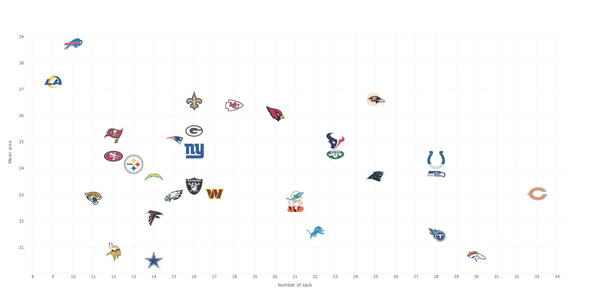
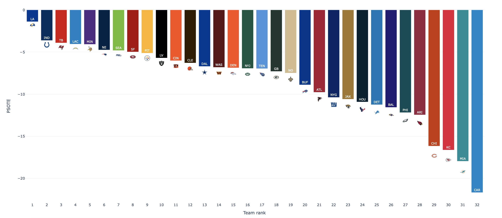
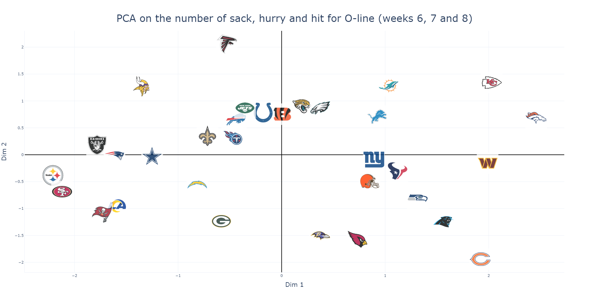

# NFL-Big-Data-Bowl-2023

Your challenge is to generate actionable, practical, and novel insights from player tracking data that corresponds to linemen performance on passing plays.

Participants will select one of three tracks in which to submit.

- Undergraduate track. This is open only to groups or individuals composed entirely of undergraduate students. Verification may be required to prove eligibility.

- Metric track. Create a metric to assess performance and/or strategy. This can be focused on offensive or defensive players, and on teams or individuals.

- Coaching presentation track. The goal of this track is to analyze and present data in a submission designed for coaches. We encourage participants interested in this track to partner with a coach (or current/former player), though that is not required.

All submissions must explicitly state which track they are submitting to. Participants may not submit to more than one track.

# Evaluating Linemen through time and space

# Introduction

*"There is no I in team"*

Evaluating the contribution of individuals to a team performance is often an ill-posed challenge. Furthermore, a single metric usually fails at grasping the subtles differences between various roles, which leads to unfair assessment of some players. Therefore, we chose to focus on a line-level metric accounting for the whole team performance on each play.

*"I know how important it is to have your quarterback standing upright. Matter of fact, I know how important it is not to allow someone hit on him period because I want him to think that this pocket is completely safe, no one is going to get to me and I got all the time in the world to make whatever decisions I need to make. "* - Emmit Smith

During passing plays, the goal of the O-line is to provide the best protection possible for the QB to launch the ball in suitable conditions. Ideally, this protection pocket needs to be as large and to last as long as possible. Conversely, the D-line wants to shrink this pocket as fast as possible to reach th opposing QB. Following this idea, we tried evaluating lines performance in terms of temporal and spatial efficiency.

To do so, we defined and implemented the measure of the QB pocket area over the time of play from which we derive a metric for comparison at league-level.

Then, we create a pocket success probability model from a priori context data via a survival model. This allows us to define a new performance metric for O-lines (resp. D-lines) evaluation by quantifying the number of successful (resp. failed) protections compared to an expected league average.

# Pocket Area

## Definition
Refering to E. Smith, we aim to give a geometrical definition of the safe zone, given the x,y coordinates of the players. 
For each frame t, we define the QB pocket area as the field region shaped by the QB and his line. 

At snap time, this area is entirely controlled by the offense, as no defender has penetrated into the pocket. However, when a rusher passes through the O-line, a fraction of pocket surrounding the defender is no longer safe. 

To account for the defense entering the pocket, we computed an occupation segmentation of the pocket. The pocket is split beetwen blockers and rushers using Voronoi partitions [[1](#Sources)]. In such partition, each linemen controls all the coordinates of the pocket which he is the closest to. Aggregating the partitions by team, we can determine the area belonging to offense and defense.

This gives us a temporal measurement of the offense pocket area which returns both the global area provided by the O-line as well as the local area taken by the D-line. 

Notice that when the QB scrambles, the pocket definition is not valid anymore. We consider that scrambling leads to the end of the play for the O-line as far as pocket protection is concerned. We monitor scrambles by comparing the QB position with the x,y extrema of the O-line. When the QB rolls out of the pocket, we are able to get the instant of scramble. This limitation on pocket definition also leads us to exclude the play actions of the study as evaluating pocket efficiency on such plays does not make sense. 

## Validation

The relevancy of our meausre is validated by discriminating between shotgun and pistol formations. The average profile of a pistol play starts with a smaller pocket which grows as the QB moves backward after the snap. Conversely, on shotgun play, the pocket is quasi-constant and eventually shrinks under the pressure of the dline for long times. The average profile is calculated by averaging the area for each frame :

$ \forall t \in [t_{snap}^{ap}, t_{e}^{ap}], $
$ A^{ap}(t) = \frac{1}{Nplays(t)} \sum_{Plays} A(t,play) $

Where :

- $A^{ap}(t)$ is the area average profile at frame t
- $N_{plays}(t)$ is the Number of plays of duration >= t
- A(t,p) is the value of the pocket area at frame t for play p
- $t_{snap}^{ap}, t_{e}^{ap}$ are respectively the average frame of snap and event (event in {pass, sack, hurry, scramble})

In addition, the results show that the size of the pocket has an influence on whether a QB scrambles or not. We were expecting QB scrambles to happen at smaller pockets than a typical pass play, as the QB feels pressure inside a tight pocket and decides to escape for more safety. When looking at the plays that end with either a 'pass' event or 'scramble' event, we observe the following area distributions:

Under the normal hypothesis, we compare their means with a student t-test which is significant (p < 0.05). In average, the QB scrambles when his pocket comes close to 13 $y^{2}$, which is 4.7 $y^{2}$ less than the protection required to pass. It shows the importance of having a wide pocket for the QB to feel safe enough.

## Evaluation of lines

It is noteworthy that excluding play actions from the study excludes the majority of the pistol formations. Indeed, pistol formations only represent less than 5% of the considered plays. Therefore, in the following section, we do not make difference beetween formations.

When grouping the previous profiles by teams, we can evaluate pocket spacing by calculating the average value of the profile, meanArea:

$ meanArea = \frac{1}{t_{e}-t_{snap}}\int_{t_{snap}}^{t_{e}}A^{ap}(t)dt $

which gives us our spatial metric to compare the teams. On the following graph, we notice a slight correlation (-0.26) between the meanArea and the number of sack suffered. 

On the first 8 weeks on competition, our metric highlights the best and worst lines, as far as spacing is concerned in average $y^{2}$ allowed:

However, as much as having a wide pocket matters, we need to investigate how the pockets last in time.

# Pocket Success Over The Expected - PSOTE
## Model
A survival model is a statistical model used to analyze time-to-event data, where the event of interest is the occurrence of a particular endpoint. Survival models are often used in medical research to estimate the probability that an event will occur at a given time, and to identify factors that may influence the time at which the event occurs. In the context of football, survival models can be used to estimate the a priori duration of effective pocket protection during a play.

## Feature Engineering

To build a survival model estimating the duration of the pocket, we select data on the context of the plays including variables such as the distance needed for a first down (yardsToGo), the number of rushers (NbRusher), the number of blockers (NbBlock), the initial position of the quarterback at the beginning of the play (qbPosition), the difference of weigth between the offensive and defensive line (WeightDiffPack), etc...

The Cox model [[2](#Sources)] meets several of our constraints : 
- it allows multiple predictor variables, defined just previously.
- it can account for the effects of censoring in the data. When a sack, a scramble or a hurry pass occur, the pocket fails. It is an endpoint. But when a traditionnal pass occurs, it is impossible to knwow how many time the pocket would have been able to survive. It is the end of the study. The time to the endpoint is unknown. This is what censoring refers to.

## Results

The plays were split in 2 sets : train set includes all the plays of the games of weeks 1 to 5 and test set includes weeks 6 to 8.

- The model converges on train set 
- The proportional hazards assumption is checked
- The concordance index is *0.64*, which is greater than or equal to the example datasets in the Lifelines library [[3](#Sources)].

The 4 subfigures below illustrate the impact of variables on the probability of survival of a pocket. 

As expected, the number of opposing rusher (NbRusher) tends to decrease the probability of survival at equal time. On the contrary, the number of players in the O-line (NbBlock) increases this probability. We also notice that the distance needed for a first down positively impacts the life expectancy, as more time is required by the offense on long plays. All these effects are significant (p < 0.05). This is not the case for the initial position of the quarterback at the beginning of the play (p > 0.05). Whether he is in pistol or in shutgun, the probability of survival varies slightly.

## Pocket Success Over The Expected - PSOTE

Now, the probability of survival is known at each moment of the play. The probability at event time can be used to inform about the impact of the lines during the play. Thus, inspired by [[4](#Sources)], we create the Pocket Success Over The Expected (PSOTE), which compares the outcome of the play (1 for a pass, 0 for a hurry, scramble or sack) to the success probabilty of the play given by the previous model: 

$PSOTE = \delta_{event \notin  \left \{ hurry, sack, scramble \right \}}-P_{survival}(t_{event})$

If a play ends with a pass, the O-line will have done its job. However, it will have more merit if the action lasted longer than whatcould be expected from the a priori data of the play. On the contrary, if the pocket dies, the O-line has failed. If this failure happens early, the probability of survival still being high, the PSOTE penalizes the D-line strongly. 

By summing up the PSOTE of all the plays of a defensive team (resp. offensive team) over a game, a week, a month or a year, we obtain an indicator evaluating the D-line (resp. O-line). It reflects the efficiency of the lines to protect the QB longer than expected. Here are the results for weeks 6 to 8 for the defensive teams: 

# Conclusion

We constructed two metrics characterising the performance of different linemen, both offensive and defensive. On the one hand, the measure of the QB pocket area over the time allows us to evaluate the safe space left to the QB and on the other hand the Pocket Success Over The Expected (PSOTE) allows us to determine if the O-line is able to protect their QB longer than expected by our model. These indicators can be used in the short and medium term as the metrics 
can be computed week by week or season by season.

Moreover, our two indicators can be combined to determine which franchises best protect their QB (resp. which franchises best prevent the opposing QB from playing).

By centering the data we can compare franchises to the league average level. 
For example, we can see that Rams' pocket area is 3 $y^{2}$ larger than the average.
Rams, Buccaneers, Colts, Steelers and Browns seems to be the best franchise to
protect their QB while Panthers, Dolphins, Bears and Lions seems to be the worst.

## Validation
Finally, to verify if the combination of the two metrics is relevant, we performed a PCA on three statistics : number of sack, hurry and hit.

Based on the results, the teams on the left-hand side like Steelers, 49ers, Buccaneers and Rams appear to be the most efficient to protect the QB as opposed to the teams on the right side like Broncos, Commanders, Bears, Panthers and Chiefs. These results are not exactly the same as the ones we had, but they are close.

# Discussion

It is also possible to adapt the PSOTE to each franchise by adding team-specific features, such as average throwing time, to the survival model. This would provide an estimate of the Pocket Success Over The Expected of each team and allow an assessment of performance against its usual level.

The above analysis was focused on O-line analysis for clarity. However, as the previous metrics are computer on play level data, we also studied the D-lines by grouping the plays by defensiveTeams. 

# Appendix
## Sources
1. https://en.wikipedia.org/wiki/Voronoi_diagram
2. https://fr.wikipedia.org/wiki/R%C3%A9gression_de_Cox
3. https://lifelines.readthedocs.io/en/latest/Survival%20Regression.html 
4. https://www.kaggle.com/code/ianjamesbarnett/nfl-big-data-bowl-2022-introducing-coyote/notebook

## Contributions

- Miguens Nathan
- Barlier Kilian
- Schortgen Alexandre

Code is available on [GitHub](https://github.com/NthnMgns/NFL-Big-Data-Bowl-2023).

